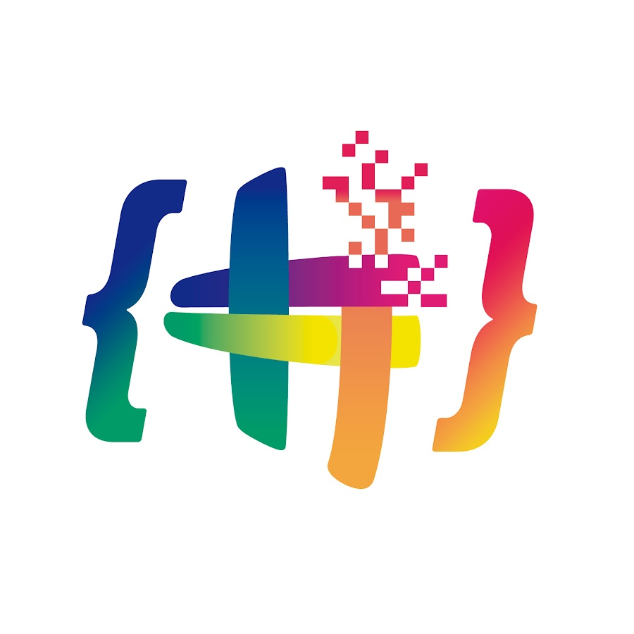
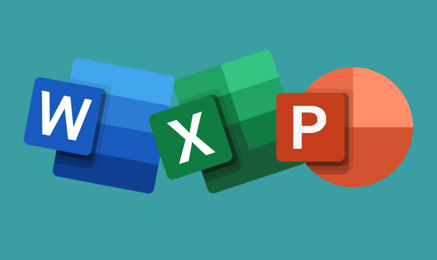
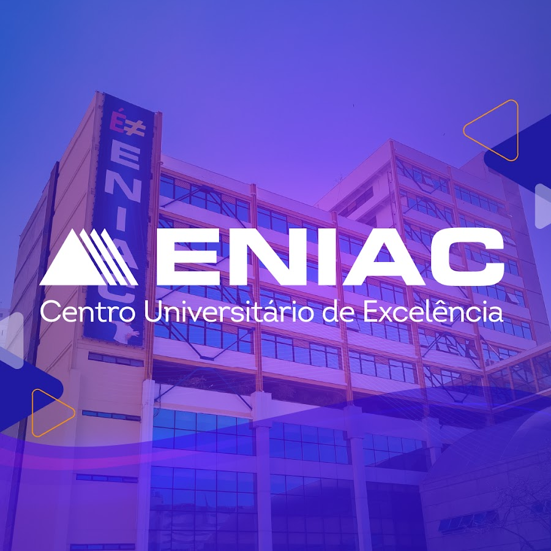
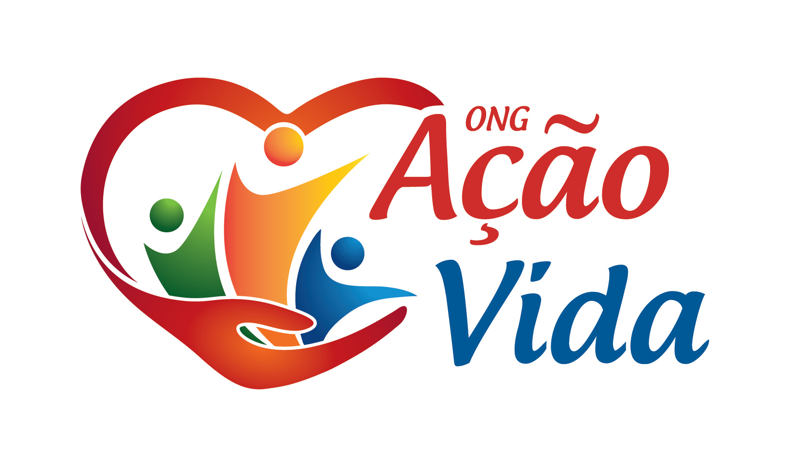
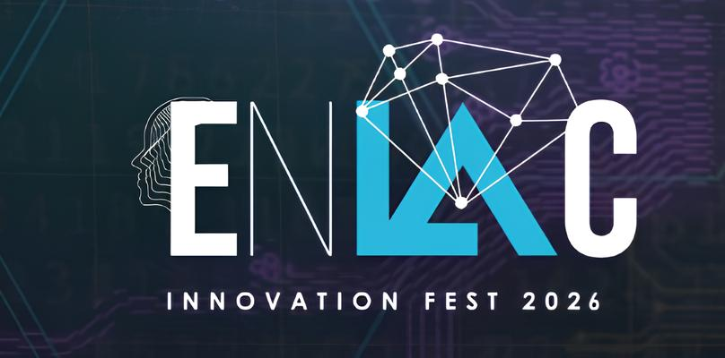

# Olá! Eu sou Rafael Brito

  
     

      
      
  

##  Formação Acadêmica

|  |  |  |  |
|:---:|:---:|:---:|:---:|
| **Técnico em Informática**  ENIAC  `2024-2026` | **Projeto React + MongoDB**  Hashtag Programação  `2025` | **Agentes de IA \| N8N**  Hashtag Programação  `2025` | **Pacote Office 365**  Hashtag Programação  `2026` |

---

##  Tech Stack

| `💼 Área` | `👨‍💻 Tecnologias` |
|------|-------------|
| 🌐 **Full-Stack** | 

 |
| 🎨 **Front-end** | 

 |
| ⚙️ **Back-end** | 

 |
| 📱 **Desenvolvimento Mobile** | 

 |
| ☁️ **Cloud & Deploy** | 

 |
| 🛢️ **Base de Dados** | 
 |
| 🤖 **Automação + IA** | 
  
 |
| 🖥️ **Ambiente & CLI** | 

 |
| ⛓️‍💥 **IDE's & Code Editors** | 

 |
| 🔧 **Ferramentas** | 

 |

---

##  Estatísticas GitHub

  
  
  

  

---

##  Eventos & Competições

|  |  |   
|:---:|:---:|:---:|
| **🎯 MOSTRATECH** ENIAC  `2024` | **🤝 ONG Ação Vida** Auxiliar Administrativo  `2024` | **🤔 Innovation fest** ENIAC  `2026` | 

---

##  Projetos em Destaque

### 🎵 [Project React](https://github.com/Rafa-A-Brito/project-react)
> **Réplica de Web Player Musical** focado em UX e manipulação de estado.
> 
> <kbd>React</kbd> <kbd>JSX</kbd> <kbd>JavaScript</kbd> <kbd>CSS</kbd>
> 
>  
 

### 📱 [Aplicação móvel GreenMind](https://github.com/Rafa-A-Brito/greenmind-kt)
> **App Ambiental** mobile aliado aos recursos de conscientização e gamificação.
> 
> <kbd>Kotlin</kbd> <kbd>Mobile</kbd> <kbd>UI/UX</kbd>
> 
> 
---

##  Idiomas

---

##  Conecte-se Comigo

      

